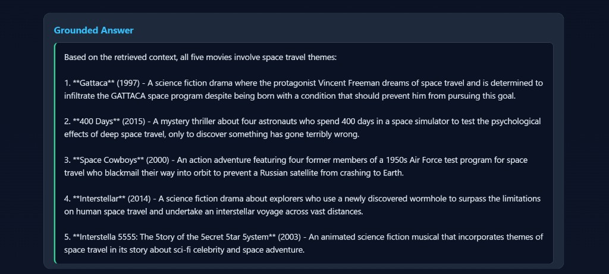

# Sadik_Movie_metadata

**Mini-Project 2 — DSA 502 S26: Flask + Ollama RAG for Movie Metadata**

A small Flask web application that answers movie-related questions by:

1. Retrieving the top-5 most relevant movies from `movies_metadata.csv` using TF-IDF + cosine similarity (the **R**etrieval stage of RAG).
2. Building a compact context block from those rows.
3. Sending the question + context to a locally-hosted LLM (`minimax-m2.1:cloud`) via the Ollama HTTP API.
4. Returning a *grounded* answer that uses only the retrieved context.

```
Question  ->  Retrieve (TF-IDF top 5)  ->  Build Context  ->  Ollama LLM  ->  Grounded Answer
```

## Project structure

```
Sadik_Movie_metadata/
├── app.py
├── requirements.txt
├── templates/
│   └── index.html
└── README.md
```

## Dataset

- URL: <https://hiperc.buffalostate.edu/courses/movies_metadata.csv>
- Columns kept: `title`, `overview`, `genres`, `release_date`, `vote_average`
- The `genres` column (a stringified list of dicts in the source file) is parsed into a comma-separated list of genre names.
- Rows missing a title or overview are dropped.

## Setup

### 1. Install Ollama and pull the model

```bash
ollama --version
ollama run minimax-m2.1:cloud
```

Keep the Ollama service running in another terminal while you launch the Flask app. The app talks to `http://localhost:11434/api/generate`.

### 2. Install Python dependencies

```bash
pip install -r requirements.txt
```

### 3. Run the app

```bash
python app.py
```

Then open <http://127.0.0.1:5005> in a browser.

The first request takes a moment because the CSV is downloaded and the TF-IDF index is built once at startup.

## How it works

`app.py` exposes four pure functions, exactly as required by the spec:

| Function | Purpose |
|---|---|
| `load_movies()` | Downloads and cleans the CSV, returns a `pandas.DataFrame`. |
| `retrieve_movies(question, df, vectorizer, matrix, top_k=5)` | Returns the top-k movies and their cosine similarity scores. |
| `build_context(rows)` | Builds a compact, numbered context block sent to the LLM. |
| `ask_ollama(question, context)` | Posts a grounded prompt to `http://localhost:11434/api/generate` with `model: "minimax-m2.1:cloud"` and `stream: false`. |

The LLM prompt explicitly instructs the model to **answer only from the retrieved context** and to say *"The retrieved context does not contain enough information to answer that."* if the context is insufficient — this is the grounding requirement from the rubric.

## Sample question

**Q:** *Find movies about space travel and exploration.*

The UI shows:

- A table of the top 5 retrieved movies with similarity scores.
- The grounded answer produced by `minimax-m2.1:cloud`.
- An expandable section showing the exact context block that was sent to the LLM.

A screenshot of the running app is included as `screenshot.png` (taken on `http://127.0.0.1:5005`).



## Error handling

- Empty input is rejected with a friendly message.
- If Ollama is not running, the app explains exactly what to start.
- HTTP timeouts, non-200 responses, and non-JSON responses are all surfaced as readable errors instead of crashing.

## Other example questions

- "What are some high-rated drama movies in this dataset?"
- "Which retrieved movies are related to war themes?"
- "Find movies with romance and comedy elements."

## Submission

- GitHub repo: `Sadik_Movie_metadata`
- All files (`app.py`, `templates/index.html`, `requirements.txt`, `README.md`, `screenshot.png`) committed and pushed.
- Repo URL submitted via the class Google Form Dropbox.
